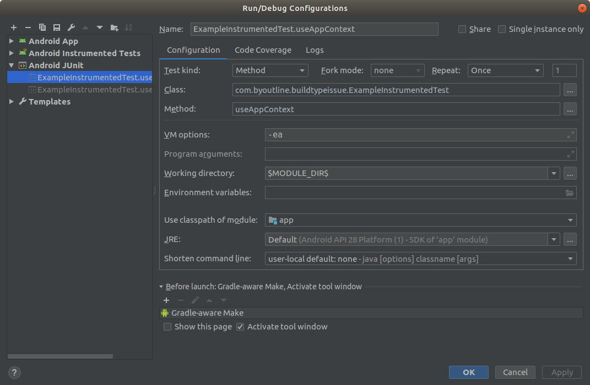
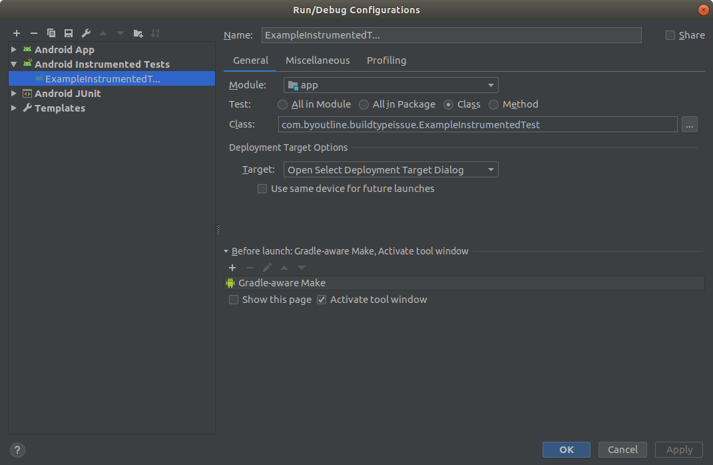

# BuildTypeIssue
Example of AndroidStudio green arrow run method issue in instrumented tests

After `testBuildType` is set in `build.gradle` the "green arrow" in Android Studio is no longer working.
Instead of expected behaviour of creating "Android Instrumented Tests" configuration
it creates "Android JUnit" configurations instead:

Running "Android JUnit" fails with no tests found.

Using run on whole class does create correct configuration which works:

